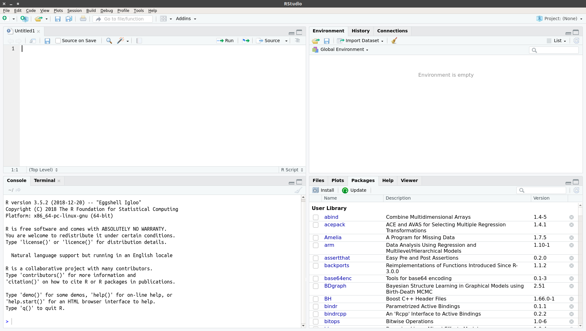

Introduction to Programming with R
##################################

:Authors: Martin Schultze

Perhaps the question I am confronted with most when teaching statistics courses to psychology undergrads is "Why should I need this, when I become a therapist"? That's a difficult one to answer in a single sentence, but I will give it a try, nonetheless: "Because everything we know in psychology - and the social sciences in general - is connected to empirical data". Well, it was a first try. As the previous sections of this volume have shown you, in scientific psychology we strive to test our claims using data. Testing our claims (ideally) leads to appropriate theories becoming successful and inappropriate theories being discarded. When you are working with patients or clients, would you not rather use techniques that have been proven to be successful in reducing negative symptoms?

Even more baffling to many of you, now reading these words, is the idea of learning a programming language like R in the first year of studying psychology. But the same reasons for learning statistics in general apply to learning R. To move from observations to conclusions requires multiple steps: encoding observations in data, organizing data, describing data, and testing hypotheses using data. The previous section showed you how to collect data in experimental settings using Python. In this and the following sections we will try to turn the data we gathered into conclusions about our hypotheses by using R - a multi-purpose tool that can be used for almost anything data-related.

Why R?
******

Many blogs are filled with heaps of reasons to use R over other software that was traditionally more prominent in the behavioral and social sciences. Here's a rundown of the "best of":

1. It's free

This is the obvious one: R costs you nothing to obtain or use. A lot of other software for data analysis requires you to either buy a specific version or rent a yearly license. R, on the other hand, you can simply download, install, and use. R is developed and maintained by `non-profit foundation<https://www.r-project.org/foundation/>`_, meaning it is free of commercial interests.

2. It's free

Yes, I've said this already, but this time it has a different meaning. This "free" pertains to the `definition of free software as proposed by GNU<https://www.gnu.org/philosophy/free-sw.en.html>`_, which can be boiled down to the phrase "the users have the freedom to run, copy, distribute, study, change and improve the software". This means that R is an open source software and this applies not only to the R-core itself, but also to the packages, which you can obtain via the official repository. This allows everyone to see what is actually happening - e.g. which formulas are used to compute statistics - and catch mistakes in the software before you publish research that is flawed (see :cite:`Eklund2016` for what may happen, when software is not open for such checks).

3. Researchers develop their tools in R and make them available as R packages

One important aspect of doing research is using the correct tools. Correct is often understood to simply mean "not wrong", but in science there is a lot of nuance to "not wrong". Some approaches may simply become outdated, because newer alternatives are available or because someone has developed an adapted version which is better suited for your specific case. Currently, many new methodological developments are implemented as R packages and made available for anyone to use. Commercial software is often slower to react, because there is not enough demand for the approach you might need, in order to implement it into a specific software. Thus, R is a more direct channel to current developments in analysis tools. To be able to use newly developed analysis tools comes with a few caveats, of course, because you lose the vetting process performed by commercial providers.

4. You can develop your own approach and implement it in R

A lot of software is limited to what has been implemented by the developers. This is where R can really shine, because it allows you to implement whatever analysis you want, as long as you are able to formulate it in the R language. Because the most basic building blocks of R are simply mathematical operations and relations there is almost no limit to what you can implement. Be aware, that this does not mean that R is the best tool to implement whatever it is, you're trying to implement; it simply means it is a tool that makes it possible at least.

5. The community

There are hundreds of resources and websites containing tutorials, guides, comparisons of approaches, and assistance. Of course, R comes with help-files and examples and there is `an extensive list of FAQs<https://cran.r-project.org/doc/FAQ/R-FAQ.html>`_, but as is the case with most programming languages, the premier resource for specific questions is `stack overflow<https://stackoverflow.com/>`_. As I am writing this, there are currently 278380 questions tagged "R" on stack overflow, most of them with well-meaning, detailed responses.

But before we can get to experts' opinions on stack overflow, there are some additional resources you can check, if the presentation in this volume leaves you with open questions. Maybe one of the websites that is visited most often in the early stages of learning R is the `Quick-R website by DataCamp<https://www.statmethods.net/>`_, where you will get quick glance answers to some of the early questions in an alternative way to our presentation here. Another way you may want to try to learn the first steps of R is through online courses like `Harvard's "Statistics and R"<https://online-learning.harvard.edu/course/statistics-and-r>`_ or `DataCamp's interactive "Introduction to R"<https://www.datacamp.com/courses/free-introduction-to-r>`_. There are also a lot of other courses out there, most of which are not free, however. Our hope is, of course, that you will be in no need for such resources once you are done with this and the following sections, but it cannot hurt, to have alternatives.

6. Everyone uses it

As, no doubt, your parents have told you on multiple occasions, this is perhaps the single worst argument on the planet to do something: "Would you jump off a bridge, if your friends did it?" Well, in this case, you might want to, because one of the core necessities for open and reproducible science is communicating your work. Not just results and conclusions, but also how you got there. As I stated above, R can be used for basically all steps between assessing data and producing manuscripts and if others use it, it may be necessary for you to be able to read what they wrote, to gain an understanding of how they structured, analyzed, and visualized their data. On the other hand, writing R code also allows other people to retrace the steps you took, because many people can read it. In 2017, Python and R were among the fastest growing programming languages - measured by the number of Stackoverflow views of questions tagged for either one of those languages (:cite:`Robinson2017a`, :cite:`Robinson2017b`). On `Bob Muenchen's Website r4stats<http://r4stats.com/>`_ you will find a continuously updated Article with current numbers on the popularity of R (:cite:`Muenchen2019`), where it is among the most sought after skills in job descriptions and the second most common software cited in scientific articles.

Gathering your tools
********************

Enough chit-chat about the benefits of R - chances are, that if you are still reading at this point, I do not need to convince you any further to use it. So, let us begin by gathering the necessary materials:

The R-Core
==========

The best way to get R is to simply grab it directly from its provider. R itself and most utensils you can add on to it are gathered in what is called CRAN (Comprehensive R Archive Network). For some nice 90s nostalgia you can visit the `CRAN website<https://cran.r-project.org/>`_ directly, but we also provide short descriptions of how to `Install R on Windows`_, `Install R on Mac OS X`_, and `Install R on Ubuntu`_ below. And for those of you who do not want to run the risk of R withdrawal symptoms: `here's a link to a short description of how to install it on an Android device<https://selbydavid.com/2017/12/29/r-android/>`_.

Install R on Windows
--------------------

Installing R on Windows machines is pretty straightforward. The CRAN Website provides you with an executable for the installation of the latest stable R Version, which you can `download here<https://cran.r-project.org/bin/windows/base/release.htm>`_. The only thing you have to keep in mind is that R does not perform automatic updates. That's where it becomes a bit tricky: it is advisable to check for a new R version every now and again - a good estimate going by `the R version history<https://cran.r-project.org/bin/windows/base/old/>`_ is every three months. To update R it is recommended to install a new R version alongside your current version, just in case the new R version broke something that worked before. For some more details on this procedure (and many others), feel free to check the `R for Windows FAQ<https://cran.r-project.org/bin/windows/base/rw-FAQ.html>`_

Install R on Mac OS X
---------------------

Current versions of R are only available for OS X 10.11 (El Capitan) and above. Since this OS is now five years old, the newer versions should cover most users, but if you are among those running an older version of OS X, you will need to install either R Version 3.3.3 (OS X 10.9 and 10.10) or R Version 3.2.1 (OS X 10.6 to 10.8). All three versions can be `found here<https://cran.r-project.org/bin/macosx/>`_.

Prior to installing R on OS X 10.8 or above, you will need to install XQuartz. Simply `download the dmg-file from the XQuartz-Website<https://www.xquartz.org/>`_ and follow the instructions provided in the installer. Afterwards, please restart your computer, before installing R.

To install R after having installed XQuartz, again simply download the `installer provided by CRAN<https://cran.r-project.org/bin/macosx/>`_ and run it. Should you be asked to install XCode during this process, please do so. As was the case with R for Windows, R does not perform automatic updates, so you should check for a new version every three months or so.

Install R on Ubuntu
-------------------

R can be installed from the repositories for many Linux distributions. We will cover the case for Ubuntu here, but you can find an online tutorial for installing R on RedHat on `this blog<https://blog.sellorm.com/2017/11/11/basic-installation-of-r-on-redhat-linux-7/>`_, for example.

To install R on a Ubuntu machine, you will need sudo-permissions. Because R is part of the Ubuntu repositories, you can simply install it via::

  sudo apt install r-base

However, this will provide you with an outdated version of R in most cases. To obtain the new version of R (and have it update automatically), there are some additional hoops. First, you need to add the necessary GPG key::

  sudo apt-key adv --keyserver keyserver.ubuntu.com --recv-keys E298A3A825C0D65DFD57CBB651716619E084DAB9

Then, you need to add the R repository to your sources list. Depending on the Ubuntu release you are running, this may look like this::

  sudo add-apt-repository 'deb https://cloud.r-project.org/bin/linux/ubuntu bionic-cran35/'

if you are running Bionic Beaver, or like this::

  sudo add-apt-repository 'deb https://cloud.r-project.org/bin/linux/ubuntu cosmic-cran35/'

if you are running Cosmic Cuttlefish. If you are running a different release, simply replace the :code:`bionic` or :code:`cosmic` by the name of your version.

Because this changes the :code:`/etc/apt/sources.list` file, you will need to::

  sudo apt update

which may take a few seconds. Afterwards, you can install R using::

  sudo apt install r-base

which should provide you with the current version. In contrast to installing R on Windows or OS X, this will provide you with automatic updates for R.

Running R for the first time
----------------------------

To run R, either open a terminal (for the OS X and Linux users out there) or run the RGUI program you just installed on your Windows machine. You should be greeted by a wall of text, looking something like this::

  ## R version 3.5.3 (2019-03-11) -- "Great Truth"
  ## Copyright (C) 2019 The R Foundation for Statistical Computing
  ## Platform: x86_64-pc-linux-gnu (64-bit)

  ## R is free software and comes with ABSOLUTELY NO WARRANTY.
  ## You are welcome to redistribute it under certain conditions.
  ## Type 'license()' or 'licence()' for distribution details.

  ##   Natural language support but running in an English locale

  ## R is a collaborative project with many contributors.
  ## Type 'contributors()' for more information and
  ## 'citation()' on how to cite R or R packages in publications.

  ## Type 'demo()' for some demos, 'help()' for on-line help, or
  ## 'help.start()' for an HTML browser interface to help.
  ## Type 'q()' to quit R.

There's a few things to pick apart here, so let's start at the top:

- :code:`R Version` obviously states the current version of R you are using, with its release date and nickname. I have tried and tried to figure it out, but, as shared by `MattBagg on Stackoverflow<https://stackoverflow.com/questions/13478375/is-there-any-authoritative-documentation-on-r-release-nicknames>`_, there is apparently no system in the nicknames.
- :code:`free software`: we talked about this above - R is free and free, so you may do with it whatever pleases you. When redistributing it, however, you should keep the license in mind.
- :code:`ABSOLUTELY NO WARRANTY`: this is the big reason some companies are still hesitant to use R in high-stakes situations. If your results are wrong because there is an error somewhere in the R-package you are using to perform your analysis, there is no one you can (legally) blame, but yourself for not checking the code thoroughly enough. Now keep in mind, that this is very rare, because most researchers publishing R packages do not just throw any half-baked ideas on CRAN, because their reputations are also tied to their work. The idea is simply, if you want to be sure everything is correct, check for yourself.
- :code:`how to cite R or R packages in publications`: this is the last point I want to highlight. Many people pour years of their lives into making the procedures work that you can then use for free. Please reward their work by citing them correctly, if your are using it. As a matter of fact, let us make this the first R command we perform:

::

    citation()

::

    ## 
    ## To cite R in publications use:
    ## 
    ##   R Core Team (2019). R: A language and environment for
    ##   statistical computing. R Foundation for Statistical Computing,
    ##   Vienna, Austria. URL https://www.R-project.org/.
    ## 
    ## A BibTeX entry for LaTeX users is
    ## 
    ##   @Manual{,
    ##     title = {R: A Language and Environment for Statistical Computing},
    ##     author = {{R Core Team}},
    ##     organization = {R Foundation for Statistical Computing},
    ##     address = {Vienna, Austria},
    ##     year = {2019},
    ##     url = {https://www.R-project.org/},
    ##   }
    ## 
    ## We have invested a lot of time and effort in creating R, please
    ## cite it when using it for data analysis. See also
    ## 'citation("pkgname")' for citing R packages.

Using the :code:`citation()` function provides you with an overview and a BibTeX source for citing R. If your analysis was performed in R, please use this function to cite it correctly.

RStudio
=======

The official way to interface with R is either via command line (if you are using OS X or Linux) or using the R GUI (if you are using Windows). Both approaches are very limited in their depiction of information and some might even want to call them ugly. This is why there are multiple frontends you can use for R. For those of you, who are already proficient in Emacs, there is `ESS (Emacs Speaks Statistics)<http://ess.r-project.org/>`_, which allows you to interact not only with R, but with a lot of other statstical languages as well. For those who enjoy a more customizable interface, I would highly recommend `Atom<https://atom.io/>`_, which allows you to interface with Python and R in the same environment and comes with integrated git-functionality. `Here is a quick description of how to get both working in Atom<https://jstaf.github.io/2018/03/25/atom-ide.html>`_. However, the most widespread IDE for R is, by far, RStudio.

RStudio is a company based in Boston, MA, developing a variety of different products centered around R. Their initial product was the IDE RStudio, which provides a much nicer GUI for R, than the original. The benefit of RStudio over the other possibilities I talked about above is that it is specifically designed for R and all of its little quirks. Thus, it is not a multi-purpose programming tool, but is focused on giving you the easiest and most intuitive way to interact with R, making it a good tool for learning and using R. Beyond that it works identically across all platforms (Windows, OS X, and Linux), making it a good tool for teaching. It also integrates some extensions on R (like R-Markdown for reporting), which we will get into later in this volume.

To install RStudio, simply `visit its download page<https://www.rstudio.com/products/rstudio/download/#download>`_ and choose the appropriate version for your system. Be aware, that RStudio is simply a frontend and requires you to have installed R as described in the previous section. In contrast to R, RStudio comes with an integrated possibility of updating - this does not update R, however! So you will still need to check for a new version every three months or so, if you are working on a Windows or OS X machine.

Everything we will do in R in the following sections can be done without RStudio, using either just the command-line version of R or any other IDE. Using RStudio is simply a recommendation, to ease your way into using R.

When you start up RStudio, the first thing you should do is to open a new R script. You can do this with :kbd:`Ctrl+Shift+n` (or :kbd:`Cmd+Shift+n`, if you are using OS X) or via :menuselection:`File --> New File --> R Script`. After doing so, your RStudio window should look something like this:

  RStudio just after opening a new R script.

There are four basic panes in this window. In the top left you have the R script you just opened. This is the spot, where you can generate your code. Writing the code does not do anything at first until it is executed. You can run the R code either by clicking the Run-button (in the top right of this pane) or by using :kbd:`Ctrl+Enter`. For example, typing in :code:`3 + 4` and executing it will send the command (3 + 4) to the console (the pane on the bottom left). Here you should then have:

::

    3+4

as a mirror of what you executed and

::

    ## [1] 7

as the result. The layout will be a bit different from what you see on this website: your commands should be preceded by a prompt :code:`>` and, by default, be in blue, while the result should be in black. Throughout the sections of this volume dealing with R, results will always be preceded by the double hash: :code:`##`.

These two panes are what you would find in almost any frontend you could use to interact with R. Where RStudio starts to shine is the remaining two. In the top-right you see a pane labeled "Environment". The other two tabs of this pane are rarely of relevance, so just concentrate on the Environment for now. This pane shows you everything that is currently active in R. We will get into this in a second, but believe me: this makes the first steps in R much easier, because you always have a quick overview of all data you are currently working with. To bottom-right pane has five tabs - all of which are relevant. "Files" gives you the possibility to navigate and open files in R. "Plots" is pretty much self explanatory and we will be generating some nice plots soon. The next tab (the one opened by default) is called "Packages" and gives you an overview of all the extensions for R that are currently installed. You can install new ones and load the ones you have installed from here, but we will be looking at more reproducible way of handling packages in a bit. Perhaps the single most important tab here is the one labeled "Help". Whenever you want to know how a function works, what it does, or how to interpret its output, the help will be opened here.

We have only just started to scrape the surface of what RStudio is and what it can do. If you want some more information on it, the documentation provided by RStudio is great. There are tons of `webinars for specific topics<https://resources.rstudio.com/webinars>`_, there is a `quick overview of how to learn to use RStudio online<https://www.rstudio.com/online-learning/>`_, and best of all, there are `a lot cheat-sheets for RStudio and the packages developed by the RStudio team<https://www.rstudio.com/resources/cheatsheets/>`_. From here on, we will not be focusing on RStudio, but more on the core functionality of R. Feel free to do everything we do in the upcoming sections in RStudio, however.

Some first, wobbly steps
************************

Let's start out with some basics of R code. Because the goal of using R is to write code that leads to reproducible data analysis and results, there are some things you need to know about the general use of R, which we will combine with some hands-on code writing. So, if you have not opened R yet, it is probably time to do so now.

Commenting and basic functionality
==================================

Use comments for everything. I can not stress this enough. Comments are your way of communicating to others and - most often the more important case - to your future self, what you are doing why. This goes beyond simple small comments and extends to structuring your code. RStudio does a good job of encouraging this, by allowing you to collapse entire sections of your code, if you are currently not interested in looking at it. For the most basic structure, I would recommend using the simple comment character :code:`#` for small comments and notes. For section titles I recommend beginning the title with :code:`####` and ending it with :code:`----`. RStudio will automatically recognize this as the section header, but even if you are using something else, this will help you keep your code organized and readable. Let's see how this works with some simple calculations in R:

::

    #### Simple calculations ----
    
    3 + 4   # Addition
    3 - 4   # Subtraction
    3 * 4   # Multiplication
    3 / 4   # Division
    3 ^ 4   # Powers

Here the section is titled "Simple calculations" and each type of calculation is described in a short comment. Now, this may be overkill, but you get the point.

As you can see, I have always left a space between the numbers and the operations. R does not care about empty space. You can even use indentation to help you organize your code without changing the functionality of your code. Beyond this, you do not need to end lines with any specific character - a simple line break ends a line. It is generally recommended to write R as you would write normal sentences, using appropriate spaces to enhance the readability of your code. If you want a detailed style guide for R code, there are `general recommendations published by Google<https://google.github.io/styleguide/Rguide.xml>`_

Now, as we have seen before, executing the basic calculations in your code will result in you receiving a copy of the code you executed, as well as a numeric result in your console. Let's take the division example:

::

    3 / 4   # Division

::

    ## [1] 0.75

Of course, numeric results are just one kind of result you can obtain from R. As you have seen above, we are often also interested in logical returns. In R, these work something like this:

::

    #### Logical relations ----
    
    3 == 4   # Equal?
    3 != 4   # Unequal?
    3 > 4    # Greater than?
    3 < 4    # Smaller than?
    3 >= 4   # Greater or equal?
    3 <= 4   # Smaller or equal?

The first one, as you should expect, returns

::

    3 == 4   # Equal?

::

    ## [1] FALSE

and the second one returns

::

    3 != 4   # Unequal?

::

    ## [1] TRUE

Internally, :code:`TRUE` is coded as a 1, while :code:`FALSE` is coded as a 0. Besides making sense, this also results in a lot of nice properties, we will be making use of soon.

Functions and arguments
=======================

What we have looked at so far as simple calculations and equality/inequality checks. These are somewhat special, because the deviate from the "normal way" of doing things in R. Normally, you use functions in R. Using the basic addition shown above, you would write:

::

    3 + 4 + 1 + 2

::

    ## [1] 10

but the way more akin to how R works in all other instances is by using the :code:`sum` function.

::

    sum(3, 4, 1, 2)

::

    ## [1] 10

Now, from this simple example you can already derive the basics of how functions work in R. The general structure is always

.. code::

  function(argument1, argument2, argument3, ...)

As you can see, the name of a function is written first and all the arguments the function requires are passed to it in parentheses, separated by commas. The :code:`sum` function is special in a way, because it can basically take an infinite number of arguments. Let's look at a more prototypical function:

::

    log(100)

::

    ## [1] 4.60517

As you can see, this returns the natural logarithm of 100. However, what if I want a logarithm with a different base? Because we are using 100 as the example, the simplest logarithm would be of base 10:

::

    log(100, 10)

::

    ## [1] 2

Let us untangle how this works: remember your school math: :math:`\log_{\text{base}} \text{argument} = \text{answer}`. So, the :code:`log` function takes the argument as its first argument and the base as its second argument. Now, because most people simply can not remember the correct order of all arguments for all functions, there is a second way of using functions:

::

    log(x = 100, base = 10)

::

    ## [1] 2

In this approach, you need to name the arguments, but are now free to provide them in any order you wish:

::

    log(base = 10, x = 100)

::

    ## [1] 2

How can you ever know the names and order of a function? There are a few different possibilities, the quickest one is probably:

::

    args(log)

::

    ## function (x, base = exp(1)) 
    ## NULL

So what does this mean? The function :code:`log` has two possible arguments: :code:`x` and :code:`base`. However, what :code:`base = exp(1)` tells you, is that there is a default in place for the :code:`base`-argument. So, if you do not provide a value for this argument, the default is used. In this case :math:`e` is defined for the exponential function :code:`exp`, but not separately. So if you use the :code:`log`-function, :code:`exp(1)` is evaluated and passed to :code:`log` as an argument. This already shows you that functions can be nested in R: the :code:`exp`-function needs to be evaluated to provide an argument for :code:`log`, so it must be evaluated first. This leads to the same simple principle you find in equations, which can make complicated R code frustrating to read: nested functions are evaluated from the inside out. There are several ways to avoid this, which we will get to in bit.

Getting and using help
======================

While we used :code:`args` to get a quick overview of the arguments for the logarithm in R in the previous section, R actually comes with a very good integrated help system. For any function you know the name of, you can simply use the :code:`help` function. In most cases, this is opened in a new window or pane, which means you can have the help opened at all times. I would encourage you not to be shy about your usage of :code:`help`. It is a much better, efficient way of learning R than typing and retyping arguments over and over. If you are using RStudio, Atom, or something similar, there is also often some form of auto-completion to help you with functions and their arguments. If it is too much effort for you to type :code:`help(function)`, you can also use :code:`?function` to achieve the same result.

So, let's look at the help for the logarithm:

::

    help(log)

opens up the help file for the :code:`log` function. You can scroll through this help, but here is a short rundown of how basic layout of any R help file:

*Description*: Usually a very short overview of what the function does.

*Usage*: The basic structure of the function. This contains all of the arguments you can use. In some cases, like the one you are currently looking at, this may contain multiple functions that are documented together, because they work in the same way.  As we discussed above, if an argument is followed by :code:`= something`, it has a fixed default. If you do not provide a value for that argument, the default is used. Conversely, this also means that any argument not followed by the equals-sign does not have a default an *must* be provided.

*Arguments*: This shows you a list of all the arguments the function accepts with a brief description of what they do and which format they must adhere to.

*Details*: Additional information you may want. For functions that perform complex analysis, this may contain a detailed description of the procedure with appropriate citations.

*Values*: A list of all the output a function produces. In R results of functions are often much bigger than what is printed, when you use them. The values listed here are all the values that are returned, even though you may not see or interact with them on a regular basis.

*See Also*: If you did not find what you were looking for, maybe these similar functions can help you.

*Examples*: Maybe the most important section. All documentation in R must ship with minimal working examples. Often the list of arguments can be overwhelming, so you may want to scroll to the bottom to look at the examples in order to see the functions in action. What you can do is copy examples and paste them into your R script to execute them. Basically, this is the same as asking the judges to hear the word in sentence when you were contestant in a spelling bee.

Apropos
-------

:code:`apropos` is function you can use instead of :code:`help`. Using :code:`help` requires you to know the exact, specific name of the function you need help with. Most of the time that is not the situation you need help in. Often the actual name of a function eludes you, which is where :code:`apropos` (or its short version :code:`??`) comes into play.

::

    apropos(logarithm)

should open a list of some possible functions you could have meant. From here, you can navigate the help files of these functions.

Messages, warnings, and errors
==============================

There is no way around it: mistakes happen. When using R, especially in the learning phases, you will produce code that is incorrect, produces errors, or does not do what you expected it to. It is important to know, that this is nothing to be afraid of. One of the advantages of R is that it is made for people who are not professional programmers, so it is rather forgiving in how mistakes can be handled. Because you can execute R code a line at a time, you can avoid the anxious time spent waiting for your code to compile before punishing you with error messages. Instead, you get an immediate feedback on what you did wrong - always think of this, when you are struggling through countless R errors.

On a fundamental level, R has three ways (in addition to just producing correct output) to communicate with you: messages, warnings, and errors.

Messages are simply a sign of a chatty programmer. Often times they provide information about the options with which you invoked a function or tell you about a package being in a beta-State. The startup we looked at in the section `Running R for the first time`_, was such a message: it gives you additional information. You can produce messages yourself:

::

    message('I am peckish.')

::

    ## I am peckish.

This makes sense, if you are running long scripts or writing your own functions and want to produce some output to give you a progress update, for example.

The second tier are warnings:

::

    warning('I am hungry.')

::

    ## Warning: I am hungry.

Warnings indicate that something probably did not go as planned. This means that the function you called still produced output, but you should check to see, whether it is really what you wanted. You can produce a warning for the logarithm-example by

::

    log(-1)

::

    ## Warning in log(-1): NaNs produced

::

    ## [1] NaN

This still produces output (:code:`NaN`, meaning 'Not a Number'), but tells you that something went awry in a warning message. If you produce a lot of warnings (more than 10, by default) R will simply say something like :code:`There were 11 warnings (use warnings() to see them)`. Then, executing :code:`warnings()` will give you a detailed output about the warnings you produced. If you really produce a lot of warnings (more than 50, by default) R will stop counting them and only return the first 50 when you invoke :code:`warnings()`.

The third tier are errors. Errors mean, that the function you called was aborted and that no output was produced. A typical error is providing the wrong arguments to functions:

::

    log(argument = 10)

::

    ## Error in eval(expr, envir, enclos): argument "x" is missing, with no default

Just like messages and warnings, you can also produce them yourself

::

    stop('I am starving.')

::

    ## Error in eval(expr, envir, enclos): I am starving.

Note that errors are produced using the :code:`stop` function, not with a function called :code:`error`. This underlines that the code is stopped at that point. If you are writing a function this means that the execution of the function is aborted at that point and that the error-message you provided is returned. In long scripts this does not mean, that the next line will not be executed, however! Because the next line is a new command, R will simply continue on without having produced the previous results, which can often result in very long chains of errors.

The text produced by warnings and errors is written to be useful in all cases, in which they can occur, so it often does not seem all that helpful. However, once you develop a better understanding of the inner workings of R, you will start noticing that they actually tell you exactly what the problem is.

Objects and the Environment
===========================

Now we are really getting into the bread and butter of R. What we saw above - typing in a function and getting a result printed out - is less frequently of interest in R than storing results of a function and using them again in some other fashion. It is also where R gains a leg-up on many of its competitors in the market of data analysis software. Storing results from one type of analysis and then using these as the data for a different type of analysis gives you the flexibility of doing whatever you want with R. Its implementation is also extremely intuitive, so let us take a look:

::

    my_num <- sum(3, 4, 1, 2)

As you can see, you did not get a result. The result of the :code:`sum` is simply stored in the object called :code:`my_num`. The arrow :code:`<-` assigns the result of the right side to whatever object is on the left side. This also works in reverse:

::

    sum(3, 4, 1, 2) -> my_num

but the first version is much more common, because it allows you to see the objects you have created faster. One important thing that just happened, that I want to draw your attention to, is that there was no warning whatsoever. In R objects are simply overwritten if you assign new content to them, so it is best to be very aware of the names for objects that you have already used. This makes it doubly important to use distinctive names for your objects (the other reason being that you want to know what is happening). The `Google Styleguide for R<https://google.github.io/styleguide/Rguide.xml>`_ that I mentioned above also contains some guidelines on how you should name your objects. These are only guidelines, however, and objects can have any name that does not start in a number.

Now that results are in an object, how do we get access to them? The easiest way is to simply write the name of the object:

::

    my_num

::

    ## [1] 10

which is shorthand for writing :code:`print(my_num)` or :code:`(my_num)`. But the goal of assigning values and results to objects is to be able to pass them on to other functions. So, in this simple example:

::

    sqrt(my_num)

::

    ## [1] 3.162278

passes our object to a function. This is essentially the same as:

::

    sqrt(sum(3, 4, 1, 2))

::

    ## [1] 3.162278

which evaluates the :code:`sum` and then passes its results to :code:`sqrt`. As you have probably guessed, there is no end to the possibilities of nesting functions or creating objects. So

::

    my_root <- sqrt(my_num)

uses the object :code:`my_num` as an argument in the square-root function and then stores the result in a new object called :code:`my_root`.

If you are using RStudio you have probably realized that both objects have appeared in the Environment tab of top-right pane. RStudio give you continuous information on what you are currently working with. Any object in the global environment (the one you are currently working in) can be accessed, used, and overwritten. The traditional R way of looking at your environment is

::

    ls()

::

    ## [1] "my_num"  "my_root"

which lists all objects and functions that you have created. If your workspace has gotten out of hand, you can also list only some objects with

::

    ls(pattern = 'num')

::

    ## [1] "my_num"

This shows you all objects which contain :code:`num` in their name. Removing objects from your workspace is also quite simple:

::

    rm(my_num)
    ls()

::

    ## [1] "my_root"

Again, notice that you do not get a warning - the object simply disappears - so you might want to be rather careful with using :code:`rm`. If you want everything in your workspace to disappear and start over with a blank slate, you can combine :code:`rm` and :code:`ls`:

::

    rm(list = ls())

where you simply provide the entire environment (as produced by :code:`ls`) as an argument to :code:`rm`.

Handling data
*************

As you saw in the previous section, objects are where results and numbers are stored. Data you assess is no different, it is only bigger. As discussed in Chapter XX, variables are the basis of assessing behavior and multiple variables are combined into datasets.

R is extremely rarely used to manually input any data. Most of the time it is either imported from a program you used to assess your experimental data (e.g. from Psychopy), downloaded from a provider you used for assessing data online (from Limesurvey, Unipark, or something similar) or transferred from a different source of data storage (e.g. from an Excel-Sheet). Nevertheless, knowing how data can be created in R can be an incredible help to understanding how data is structured, when it comes from somewhere else.

Vectors
=======

So let us build a minimal example: say you observed reaction times of five participants in a `Stroop test<http://www.yorku.ca/pclassic/Stroop/>`_ (:cite:`Stroop1935`), one of the classics of experimental psychology. The basic idea is best conveyed in a picture:

.. figure:: https://upload.wikimedia.org/wikipedia/commons/f/fe/Stroop_effect_memory_test.png
    The basic idea of a stroop test (Fitness queen04, `CC BY-SA 3.0< https://creativecommons.org/licenses/by-sa/3.0>`_).

The Stroop effect is the difference between the time it takes you to correctly name the color a word is printed in, when the word and text color match versus when the do not (see :cite:`MacLeod1991` for an overview over the first 50 years of its existence). If you want to see how it works, you can check your performance in an online version on `Open Cognition Lab<http://opencoglab.org/stroop/>`_, for example.

Now, let's say you measured six reaction times manually, by administering a minimal version of the Stroop to a friend. The times could be (in milliseconds) 597, 1146, 497, 938, 1080, and 1304. To input data as one vector in R, you can use

::

    react <- c(597, 1146, 497, 938, 1080, 1304)

Calling the :code:`help` function on :code:`c` (as discussed in `Getting and using help`_) reveals that it is a basic function to combine all arguments (in this case six reaction times) into a single object. This object is a vector: a one-dimensional array of information, which is of the same type. You can find out what type of vector you just stored your information in in multiple ways. We can use

::

    class(react)

::

    ## [1] "numeric"

to start, because that provides us with the most basic information about the object :code:`react`: it is a numeric vector. Using

::

    str(react)

::

    ##  num [1:6] 597 1146 497 938 1080 ...

we obtain a bit more detailed information about the *structure* of the object: it is numeric (:code:`num`), it contains the elements one through six (:code:`[1:6]`), and we see a preview of this object, namely its first five elements.

There are three general types of vectors in R:

+--------------------+--------------------+----------------------------------------+
| Type               | Shorthand          | Content                                |
+====================+====================+========================================+
| :code:`logical`    | :code:`logi`       | :code:`TRUE` or :code:`FALSE`          |
+--------------------+--------------------+----------------------------------------+
| :code:`numeric`    | :code:`num`        | Any type of number                     |
+--------------------+--------------------+----------------------------------------+
| :code:`character`  | :code:`chr`        | Any combination of letters and numbers |
+--------------------+--------------------+----------------------------------------+

Continuing with the Stroop example, the color of the text that was presented is relevant information. We could encode this in a character vector:

::

    color <- c('green', 'purple', 'blue', 'purple', 'red', 'green')

We can check whether this is a :code:`character` vector with

::

    is.character(color)

::

    ## [1] TRUE

In general, the :code:`is.` prefix can be combined with all types of data storage in R, to check whether it is of that type. The same goes for :code:`as.` which can be used for a simple attempt to convert data from one type to another. For the vector-types we have seen, you could use

::

    as.numeric(color)

::

    ## Warning: NAs introduced by coercion

::

    ## [1] NA NA NA NA NA NA

As you can see, this produces a warning (see `Messages, warnings, and errors`_) and the resulting vector contains only :code:`NA`. This is R's way of encoding the absence of information and is short for *not available*. This occurs, because R has no idea how to transform the word :code:`'green'` into a number. Using the basics of measurement theory that were discussed in Chapter XX, we know that what R is missing is some form of adequate relation. We will discuss how this is done in `Factors`_, but for now, let us continue with vectors.

Next to the color, the actual text we are presented with in the Stroop test is also quite important. So, we can generate another character vector:

::

    text <- c('green', 'purple', 'blue', 'green', 'blue', 'red')

Now, the core effect found by :cite:`Stroop1935` is that the reaction is slower, when the color and the text are incongruent. We can use the logical relations shown in `Commenting and basic functionality`_ to generate a logical vector:

::

    cong <- color == text

In `Commenting and basic functionality`_ we saw how comparisons work, when we compare two elements. And incredible positive about R is that most things (e.g. functions and mathematical operations) also work when applied to entire vectors or matrices of data. What happened in this instance, is that the elements in :code:`color` and the elements in :code:`text` were compared one-by-one: is the first element in :code:`color` the same as the first element in :code:`text`? Is the second element in :code:`color` the same as the second element in :code:`text`? And so on... This results in a logical vector of the same length as the two original vectors, because they were compared element-wise:

::

    cong

::

    ## [1]  TRUE  TRUE  TRUE FALSE FALSE FALSE

As you can see, this is a logical vector:

::

    is.logical(cong)

::

    ## [1] TRUE

Factors
=======

R's way of storing variables with a nominal or ordinal scale is a type of special vector called a :code:`factor`. These factors have the special property of being numeric while also storing information about what each numeric value means. Take the color variable from our example: we can convert the character vector containing the colors of the presented to a factor by using

::

    color_fac <- as.factor(color)

and to obtain some overview of what this now looks like:

::

    str(color_fac)

::

    ##  Factor w/ 4 levels "blue","green",..: 2 3 1 3 4 2

As you can see, this factor contains numeric values (:code:`2 3 1 3 4 2`), but also encodes what each of these numbers mean, by assigning levels. To see all levels of a factor, you can use

::

    levels(color_fac)

::

    ## [1] "blue"   "green"  "purple" "red"

As you can probably guess, the numeric values are assigned by the way these levels are ordered. Because the original we converted to a factor was a character vector, these levels are ordered alphabetically. Specifically, all unique values of the vector:

::

    unique(color)

::

    ## [1] "green"  "purple" "blue"   "red"

are ordered and then used as the levels of the factor. Printing the contents of the factor returns the levels, which are associated with each value, not the number that is stored:

::

    color_fac

::

    ## [1] green  purple blue   purple red    green 
    ## Levels: blue green purple red

which is much more useful, because we will rarely have code-book lying next to our screen where we can look up what each number means. Additionally printing a factor returns the *possible* values, meaning all levels of the factor. Be aware that this makes it possible to have levels of factors, which are not realized in the data.

The dual storage of information makes it, so that factors can easily be converted to :code:`numeric` or :code:`character`:

::

    as.numeric(color_fac)

::

    ## [1] 2 3 1 3 4 2

::

    as.character(color_fac)

::

    ## [1] "green"  "purple" "blue"   "purple" "red"    "green"

whichever is more relevant at the moment. However, even though there are numbers associated with each level, the values order of the values is arbitrary, meaning normal factors encode nominal scales. You can even change which level comes first, i.e. which level is the reference level, by using:

::

    color_fac <- relevel(color_fac, 'green')

This command overwrites the original object :code:`color_fac` with a new version, where :code:`'green'` is the first level. All other levels are simply moved back:

::

    levels(color_fac)

::

    ## [1] "green"  "blue"   "purple" "red"

If your original is a character vector, the strings are simply used as the levels. If your original vector is numeric, this does not really help you. Take the numeric version of our colors:

::

    color_num <- c(2, 3, 1, 3, 4, 2)

and convert it to a factor:

::

    color_fac2 <- as.factor(color_num)
    levels(color_fac2)

::

    ## [1] "1" "2" "3" "4"

the resulting levels are not really helpful. In this case, you can provide new levels to the object.

::

    levels(color_fac2) <- c('blue', 'green', 'purple', 'red')
    color_fac2

::

    ## [1] green  purple blue   purple red    green 
    ## Levels: blue green purple red

Let's take a quick look at how this works: there are four levels (1, 2, 3, 4) from the conversion of the numeric vector. These four levels can be provided with new labels (blue, green, purple, red). Thus, it is important that there are actually four levels, which we assign to levels attribute. We don't need to assign the values for each observation of the variable, but only the unique levels.

Now, as I've noted, normal factors encode nominal scales. You can also encode ordinal variables with the :code:`ordered` type. Say we ordered the colors by their wavelengths: purple (with the shortest wavelength), blue, green, red.

::

    color_ord <- as.ordered(color)
    color_ord

::

    ## [1] green  purple blue   purple red    green 
    ## Levels: blue < green < purple < red

Well that's not what we wanted. I will leave it up to you to find out how the correct order of colors can be achieved in this case! At this point, all you need, is to be aware that unordered (i.e. nominal) and ordered (i.e. ordinal) variables can both be used in R. As a matter of fact, this is one of the many cases in R, where one is simply a special version of the other:

::

    is.factor(color_ord)

::

    ## [1] TRUE

::

    is.ordered(color_fac)

::

    ## [1] FALSE

meaning that :code:`ordered` is a special case of :code:`factor`.

Combining data
==============

As a result of the section on `Vectors`_, we have four different objects in our environment, which all relate to the same thing. Naturally, the best idea would be to combine them somehow. As with vectors, there are multiple types of storing data sets in R, but their relationships are a bit more complicated. Let's get a general overview:

+--------------------+-------------------------------------------------------+
| Type               | Content                                               |
+====================+=======================================================+
| :code:`matrix`     | Vectors of the same length and type (two dimensional) |
+--------------------+-------------------------------------------------------+
| :code:`array`      | Vectors of the same length and type (n-dimensional)   |
+--------------------+-------------------------------------------------------+
| :code:`data.frame` | Vectors of the same length                            |
+--------------------+-------------------------------------------------------+
| :code:`list`       | Any objects                                           |
+--------------------+-------------------------------------------------------+

As you can see, the types are more specialized the further to they are to the top of the table. More specialized types restrict your possibilities of combining arbitrary information, but make storing and handling data more efficient in terms of computational power. Especially when handling abstrusely large data (such as raw fMRI or genetical data), I would highly recommend using matrices. Matrices are especially useful, because you can simply apply matrix-algebra to them, making computation and data analysis much easier.

As you can probably tell from the table, a :code:`matrix` is a special case of an :code:`array` - the two dimensional one. Less obvious is the fact that :code:`data.frame`s are special cases of :code:`list`s, i.e. the one where all content is of exactly the same length.

Let's begin by constructing a matrix. For this, we need to ensure that the objects we intend to combine are of the same type and of the same length:

::

    class(color)

::

    ## [1] "character"

::

    class(text)

::

    ## [1] "character"

::

    length(color)

::

    ## [1] 6

::

    length(text)

::

    ## [1] 6

or, more simply:

::

    class(color) == class(text)

::

    ## [1] TRUE

::

    length(color) == length(text)

::

    ## [1] TRUE

If we want to combine these two to a matrix, there are multiple ways, but the two main approaches are, by either using the :code:`matrix` function or by using :code:`cbind`. We will use the second approach here, but I encourage you to take a look at :code:`help(matrix)` and try this approach to reconstruct what is happening here.

The function :code:`cbind` refers to *binding* vectors together as mulitple *columns*. Traditionally, data frames are organized in such a fashion, that columns represent different variables, while rows represent different observations (e.g. people). If you wanted to combine data from different people that were observed on the same number of variables (e.g. the six reaction times of two different people) you would use :code:`rbind`, for *binding* multiple *rows*. In our case, we can combine :code:`text` and :code:`color` to a matrix:

::

    mat <- cbind(color, text)

The resulting object is a matrix:

::

    class(mat)

::

    ## [1] "matrix"

but - because matrices are special cases of arrays - it is also an array!

::

    is.array(mat)

::

    ## [1] TRUE

What matrices are not, is special cases of :code:`data.frame`s or :code:`list`s:

::

    is.data.frame(mat)

::

    ## [1] FALSE

::

    is.list(mat)

::

    ## [1] FALSE

Combining :code:`color` and :code:`text` worked, because both are of the same type (:code:`character`). However, the data we have is also numeric (the reaction times) and logical (the indicator of congruence). If you combine all of them using the :code:`cbind` command, the following will happen:

::

    mat <- cbind(color, text, cong, react)
    mat

::

    ##      color    text     cong    react 
    ## [1,] "green"  "green"  "TRUE"  "597" 
    ## [2,] "purple" "purple" "TRUE"  "1146"
    ## [3,] "blue"   "blue"   "TRUE"  "497" 
    ## [4,] "purple" "green"  "FALSE" "938" 
    ## [5,] "red"    "blue"   "FALSE" "1080"
    ## [6,] "green"  "red"    "FALSE" "1304"

All vectors were combined, but they were all converted to the most general type of vector of the three: :code:`character`. This is bad, because you loose the numeric information in the variable :code:`react` and can not use it for calculations and thus statistical analysis.

This is why, in most cases you will encounter with behavioral data, :code:`data.frame`s are the type of storage needed. You can combine the four vectors like this:

::

    dat <- data.frame(color, text, cong, react)

This results in a :code:`data.frame` with six rows and four columns:

::

    str(dat)

::

    ## 'data.frame':	6 obs. of  4 variables:
    ##  $ color: Factor w/ 4 levels "blue","green",..: 2 3 1 3 4 2
    ##  $ text : Factor w/ 4 levels "blue","green",..: 2 3 1 2 1 4
    ##  $ cong : logi  TRUE TRUE TRUE FALSE FALSE FALSE
    ##  $ react: num  597 1146 497 938 1080 ...

::

    dat

::

    ##    color   text  cong react
    ## 1  green  green  TRUE   597
    ## 2 purple purple  TRUE  1146
    ## 3   blue   blue  TRUE   497
    ## 4 purple  green FALSE   938
    ## 5    red   blue FALSE  1080
    ## 6  green    red FALSE  1304

As you can see, R automatically converts character vectors to factors! This is because that is what is most often desired. As with (almost) all behavior of R, you can adjust this. As we saw in `Functions and arguments`_, this is only a matter of identifying the correct argument and changing its value. You can check :code:`help(data.frame)` and will see that the argument we are looking for is aptly named :code:`stringsAsFactors`. So:

::

    dat2 <- data.frame(color, text, cong, react, stringsAsFactors = FALSE)

will provide us with a :code:`data.frame` in which the character vectors remain as such. We can check:

::

    str(dat2)

::

    ## 'data.frame':	6 obs. of  4 variables:
    ##  $ color: chr  "green" "purple" "blue" "purple" ...
    ##  $ text : chr  "green" "purple" "blue" "green" ...
    ##  $ cong : logi  TRUE TRUE TRUE FALSE FALSE FALSE
    ##  $ react: num  597 1146 497 938 1080 ...

The final way of storing data is simultaneously the least efficient and most regularly used form: :code:`lists`. The latter is the case because most functions return lists as results. For very large data sets I would advise against using list, because they tend to slow everything down quite drastically. In general, if it is at all possible to simplify your data into a data type that is above it in the table I presented at the beginning of this section, you should probably do it.

Nevertheless, lists are useful, because you can combine all types of information and data. A simple case is a list of different vectors:

::

    lst <- list(color, text, cong, react)
    str(lst)

::

    ## List of 4
    ##  $ : chr [1:6] "green" "purple" "blue" "purple" ...
    ##  $ : chr [1:6] "green" "purple" "blue" "green" ...
    ##  $ : logi [1:6] TRUE TRUE TRUE FALSE FALSE FALSE
    ##  $ : num [1:6] 597 1146 497 938 1080 ...

The structure of this looks eerily similar to that of the :code:`data.frame` we looked at before. That is because, as mentioned, :code:`data.frame`s are simply special lists. The difference is that you can store anything in your list, even other lists!

::

    meta_list <- list('Person 1', lst, dat)
    str(meta_list)

::

    ## List of 3
    ##  $ : chr "Person 1"
    ##  $ :List of 4
    ##   ..$ : chr [1:6] "green" "purple" "blue" "purple" ...
    ##   ..$ : chr [1:6] "green" "purple" "blue" "green" ...
    ##   ..$ : logi [1:6] TRUE TRUE TRUE FALSE FALSE FALSE
    ##   ..$ : num [1:6] 597 1146 497 938 1080 ...
    ##  $ :'data.frame':	6 obs. of  4 variables:
    ##   ..$ color: Factor w/ 4 levels "blue","green",..: 2 3 1 3 4 2
    ##   ..$ text : Factor w/ 4 levels "blue","green",..: 2 3 1 2 1 4
    ##   ..$ cong : logi [1:6] TRUE TRUE TRUE FALSE FALSE FALSE
    ##   ..$ react: num [1:6] 597 1146 497 938 1080 ...

References
**********

.. bibliography::

  references.bib
